<div align="center">

<picture>
  <source media="(prefers-color-scheme: dark)" srcset="assets/mark-light.png">
  
</picture>

# Entitle

**Carry the entitlement. Never the diagnosis.**

A portable, permissioned proof of what a person is *owed* —<br>
that never carries what is *wrong with them*.

[**Live prototype →**](https://entitle-passport.vercel.app) &nbsp;·&nbsp; [Deck](deck/Entitle.pptx)

<sub>AI Passport Ideathon 2026 &nbsp;·&nbsp; Track: Work &nbsp;·&nbsp; Lane: Build</sub>

</div>

<br>

## The problem

Getting a disability accommodation means proving you deserve it — not once, but **every
time, to every institution, starting from zero**.

And the proof everyone asks for is a medical diagnosis. An exam board that needs to know
you get 1.5× time will ask for your condition, your medication and a letter from your
clinician. It has no use for any of it. It asks because a letter is the only unit of proof
that exists.

<br>

## The scenario

Priya is a final-year student with ADHD and a chronic pain condition. She was assessed
once, in 2023. Nothing about her has changed since.

She has proved it five times anyway.

| | 2023 | 2024 | 2025 | 2026 | 2026 |
|:--|:--|:--|:--|:--|:--|
| **Who asked** | University | Internship | Study abroad | Exam board | Employer |
| **What they demanded** | Full assessment report | Doctor's letter | Diagnosis + medication | Letter under 6 months | Occupational health referral |
| **What they needed** | Extra time | Flexible start | Extra time | Extra time | Interview format |

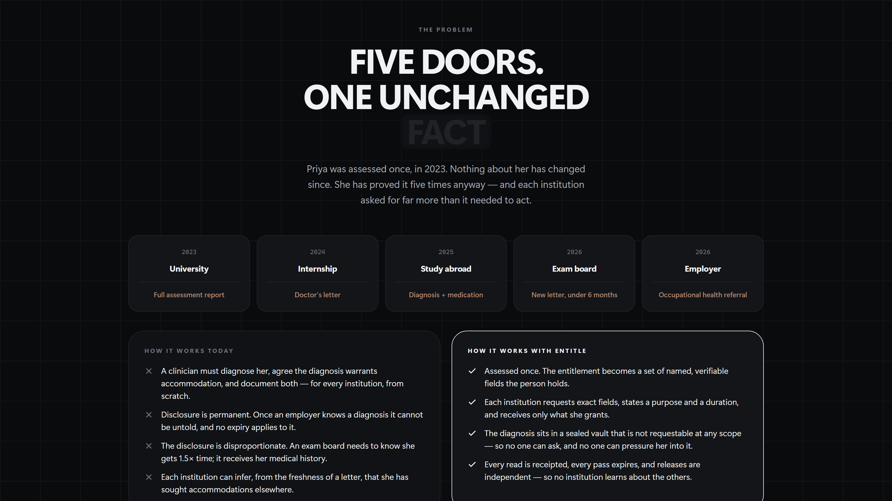

Read the last two rows together. Every institution demanded a **medical diagnosis** in
order to grant a **scheduling change**.

<br>

## Why it's such a hassle

Not paperwork. Four separate failures, none of which are fixed by filling the form faster.

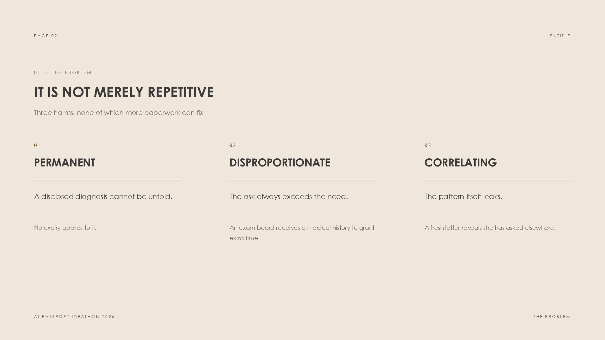

**It costs money and months.** Each round means finding a clinician, waiting for an
appointment, and paying for a report. Private assessments run into the hundreds. Some
institutions reject letters older than six months — so a permanent condition needs repeat
proof of something that will never change.

**Disclosure is permanent.** Once an employer knows a diagnosis it cannot be untold. No
expiry applies, no policy retracts it, and you never learn how it shaped a decision that
was explained to you in other terms.

**The ask always exceeds the need.** An exam board receives a medical history to arrange a
quiet room. Every institution ends up holding special-category health data it never
wanted, cannot use, and now has to defend.

**The pattern itself leaks.** A letter dated last month tells an employer she recently
sought accommodations *somewhere else*. She never disclosed that — and no existing process
counts it as a disclosure at all.

> The American Bar Association describes the requirement as so onerous that it
> **"adds an element of discrimination to the enforcement of anti-discrimination law."**

The burden lands hardest on invisible disabilities, where scepticism runs highest and the
person is asked to prove themselves most often.

<br>

## What a fix has to do

Work backwards from those failures and the requirements are specific.

**1 · Separate the entitlement from the reason.** An institution needs to know *what
accommodation to provide*, not *why*. Two different facts, welded together by the letter.

**2 · Move between parties who will never integrate.** A university won't hand medical
records to an employer's vendor. An employer won't accept a competitor's assessment API.
No shared database is coming, because none of them want one.

**3 · Be a resolvable pass, not a copy.** If institutions receive a file, revocation is a
polite request. Whatever moves must stay scoped, purpose-bound and expiring by default.

**4 · Leave evidence.** The person should see who read what, when, and under what
authority — and be able to end it without explaining herself.

Put those together and the shape is forced. The only party with both an incentive to carry
this and the standing to hold it is **the person it describes**.

<br>

## What we built

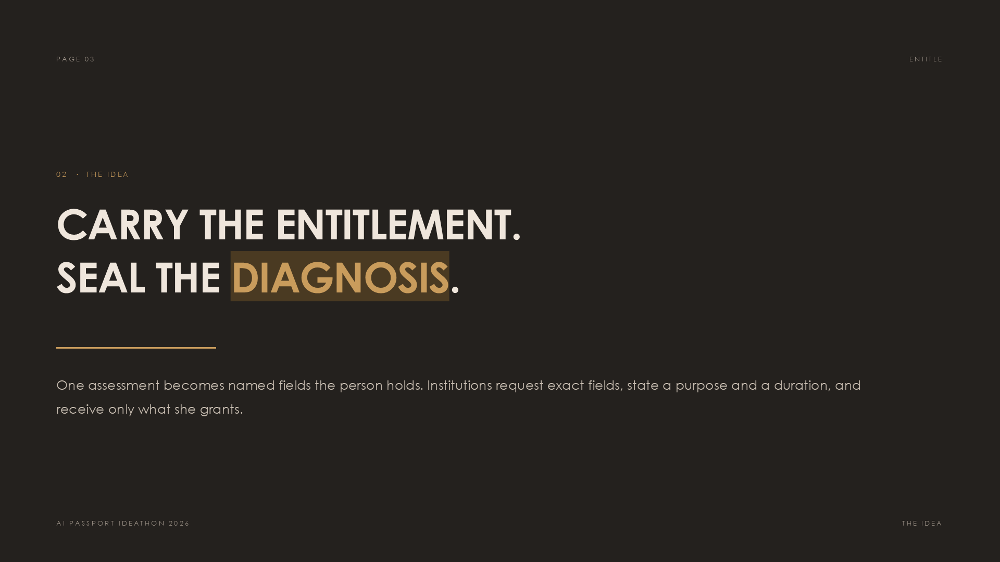

**Entitle** is a permissioned pass for accommodations, built on AI Passport.

A clinic diagnoses once and issues a pass. The functional entitlements — `extra_time`,
`flexible_start` — become named, verifiable fields the person holds. Institutions request
exact fields, state a purpose and a duration, and receive only what she grants.

The diagnosis, clinician, medication and report stay sealed in a **Vault** that is not
requestable at any scope. Not gated behind a stricter permission — **unaskable**. There is
no flow that discloses a diagnosis, so there is no flow an employer can pressure a
candidate into.

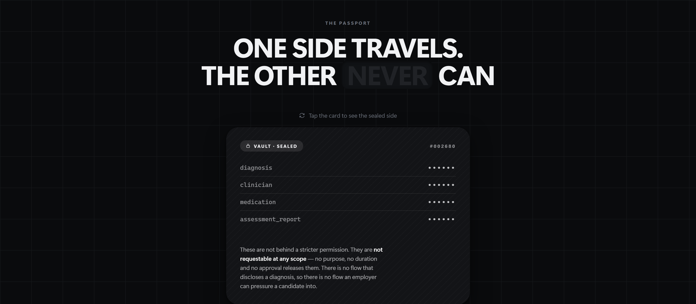

<sub>The passport has two sides. Flip it and the second one is sealed — not hidden behind
a stronger permission, but absent from every request path.</sub>

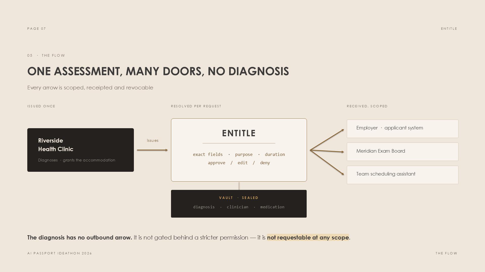

The diagnosis has **no outbound arrow**. That is the entire design.

<br>

## How it works

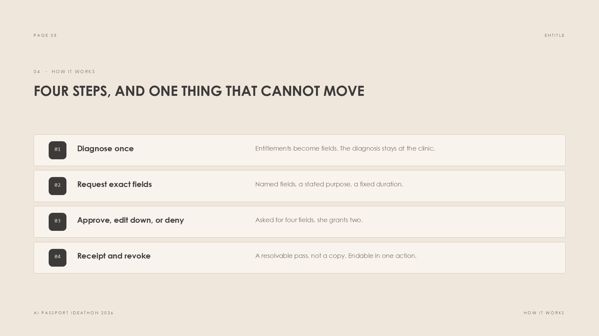

Every request names exact fields, states why, and states for how long. Nothing moves until
she approves it, and she can end it afterwards.

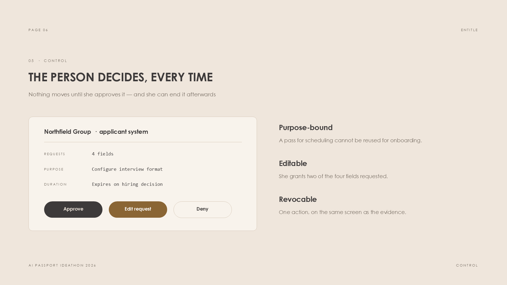

<br>

## Walk the loop

The [prototype](https://entitle-passport.vercel.app) runs the full lifecycle. Nothing is
pre-baked — the ledger moves with your choices.

**1 · Request** — Priya asks the clinic holding her medical record to issue a portable
pass for the accommodations it assessed her as needing.

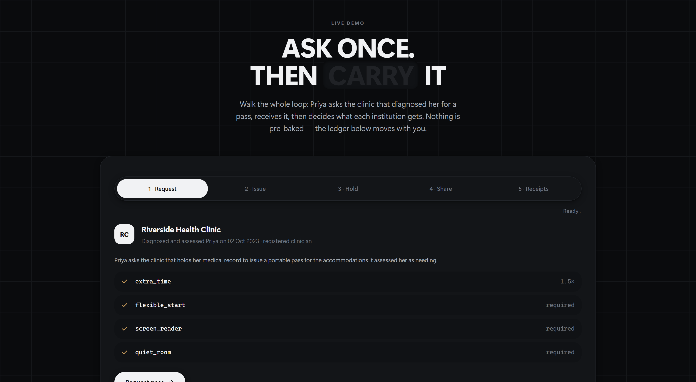

**2 · Issue** — locate clinical record → confirm clinician registration → **seal diagnosis
to Vault** → mint pass. The diagnosis never enters the pass; it stays inside the clinic.

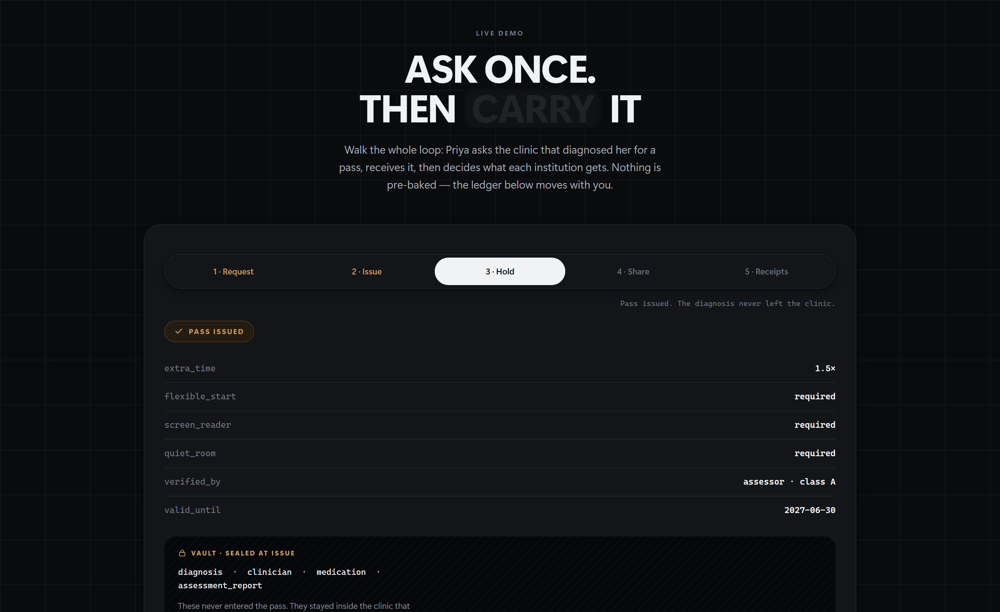

**3 · Share** — three institutions ask at once. Each names exact fields, a purpose and a
duration, and pre-selects only the minimum. Untick anything that stage doesn't need, then
grant or deny per institution.

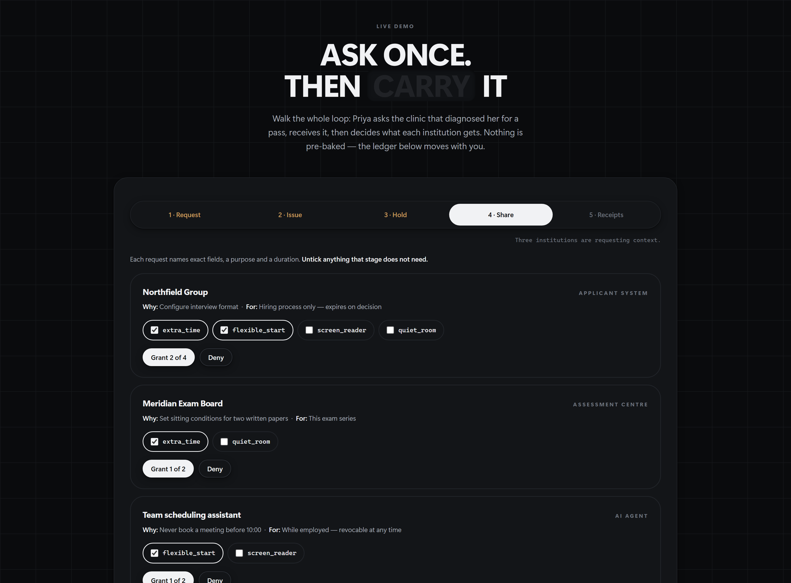

**4 · Receipts** — every decision becomes a receipt she can revoke in one action, without
explaining why.

<br>

## What travels, and what never can

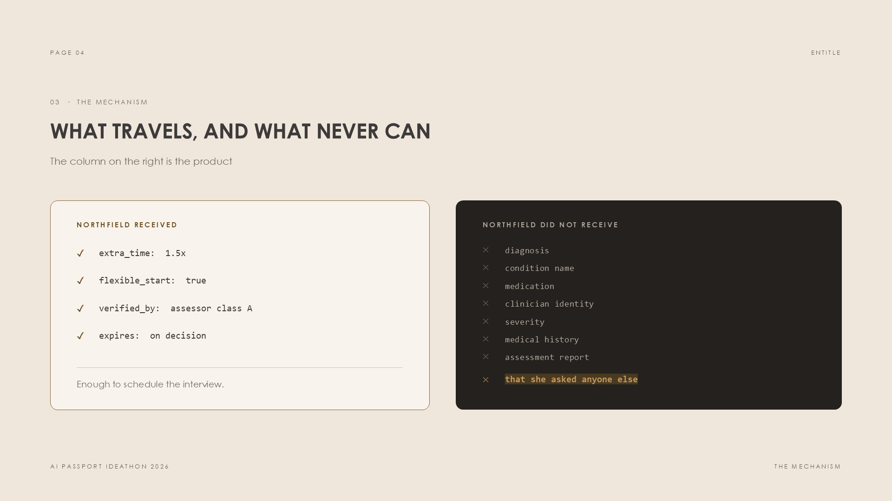

| ✓ Northfield received | ✕ Northfield did not receive |
|:--|:--|
| `extra_time: 1.5×` | `diagnosis` |
| `flexible_start: true` | `condition name` · `medication` |
| `verified_by: class A` | `clinician identity` · `severity` |
| `expires: on decision` | `medical history` · `assessment report` |
| | **that she asked anyone else** |

The right column is the product. That last line is the disclosure no current process
prevents, because no current process counts it as one.

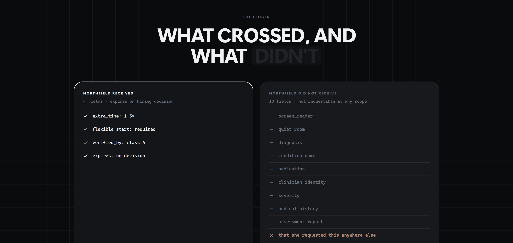

<br>

## Why this is a good idea

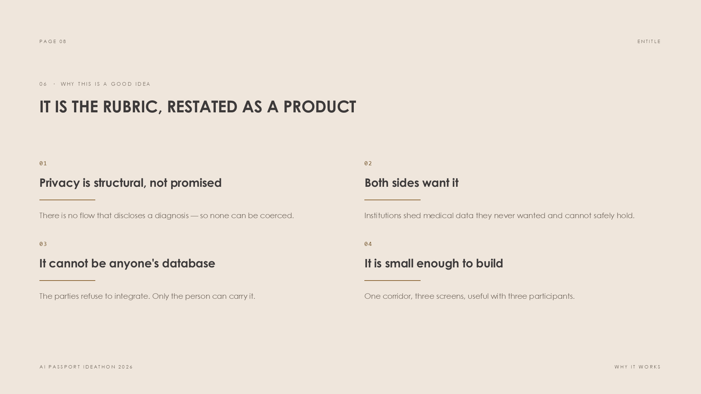

- **Privacy is structural, not promised.** No flow discloses a diagnosis, so none can be coerced.
- **Both sides want it.** Institutions shed special-category data they never wanted and cannot safely hold.
- **It cannot be anyone's database.** The parties refuse to integrate; only the person can carry it.
- **It is small enough to build.** One corridor, three screens, useful with three participants.

<br>

## Privacy and risk

A design that only lists its strengths hasn't been thought through.

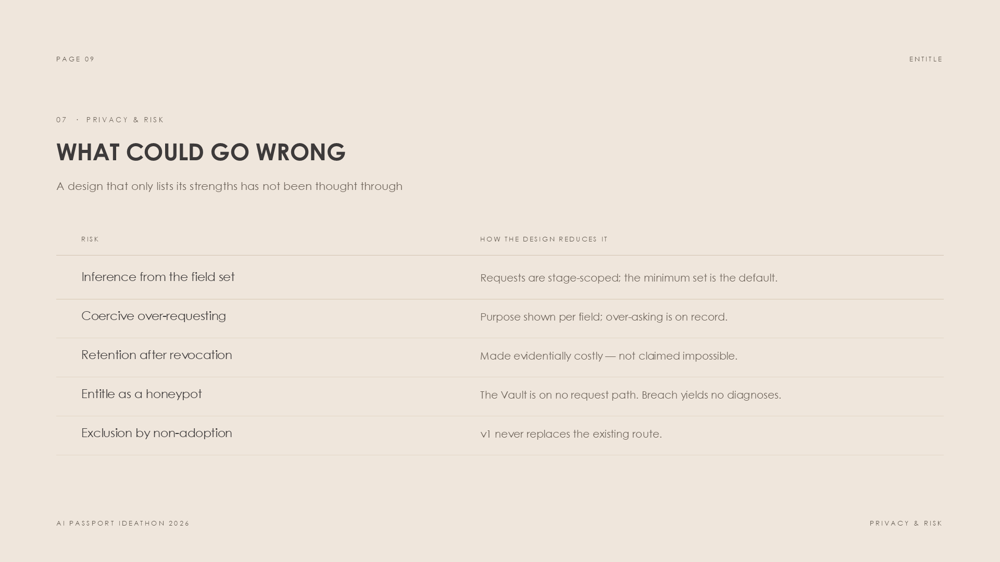

| Risk | How the design reduces it |
|:--|:--|
| Inference from the field set | Requests are stage-scoped; the minimum set is the default |
| Coercive over-requesting | Purpose shown per field; over-asking is on record |
| Retention after revocation | Made evidentially costly — **not** claimed impossible |
| Entitle becoming the honeypot | The Vault is on no request path; a breach yields accommodations, not diagnoses |
| Exclusion by non-adoption | v1 never replaces the existing route |

<br>

## First version

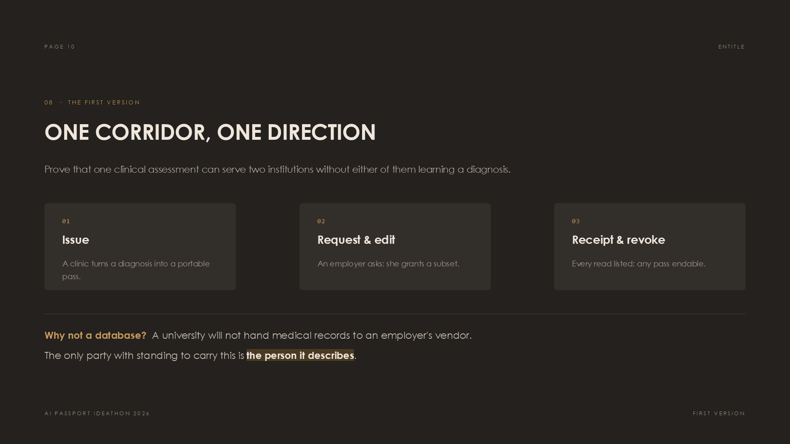

One corridor, one direction — prove that a single clinical assessment can serve two
institutions without either learning a diagnosis.

1. **Issue** — a clinic turns a diagnosis into a portable pass
2. **Request & edit** — an employer asks; she grants a subset
3. **Receipt & revoke** — every read listed, any pass endable in one action

*Out of scope for v1:* multi-country assessor accreditation, employer-side enforcement
tooling, write-back of new entitlements.

<br>

## Repository

```
index.html           the prototype — single file, no build step, no dependencies
deck/Entitle.pptx    12-slide submission deck
assets/              screenshots
```

One self-contained HTML file: inline styles, inline SVG icons, the mark embedded as a data
URI. Runs from `file://`, respects `prefers-reduced-motion`, and is built for both light
and dark themes.

<br>

## The deck

Twelve slides, built to the same brief. [Download the `.pptx` →](deck/Entitle.pptx)

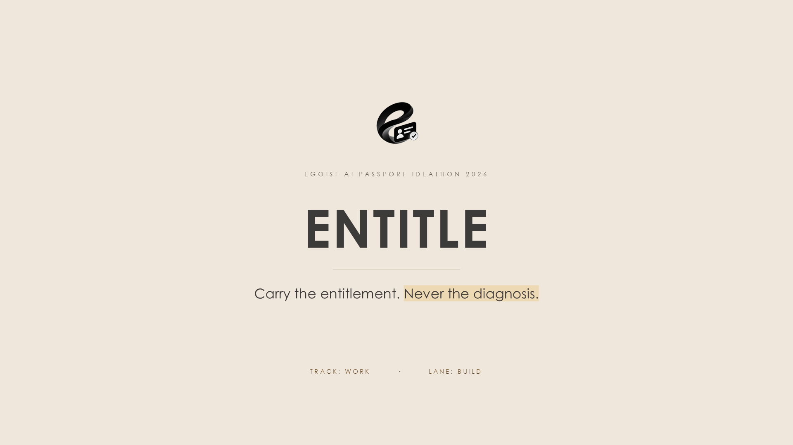

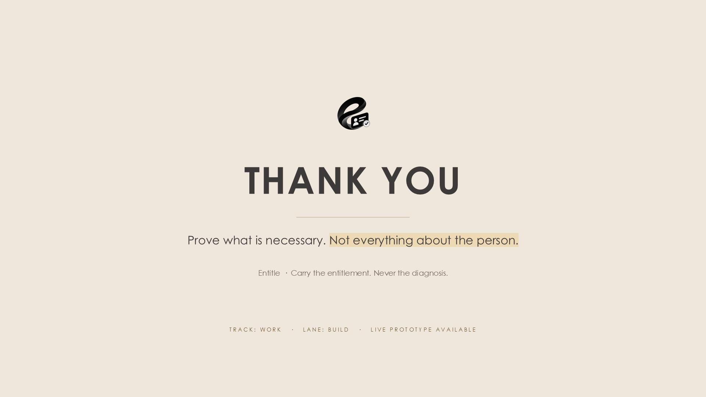
